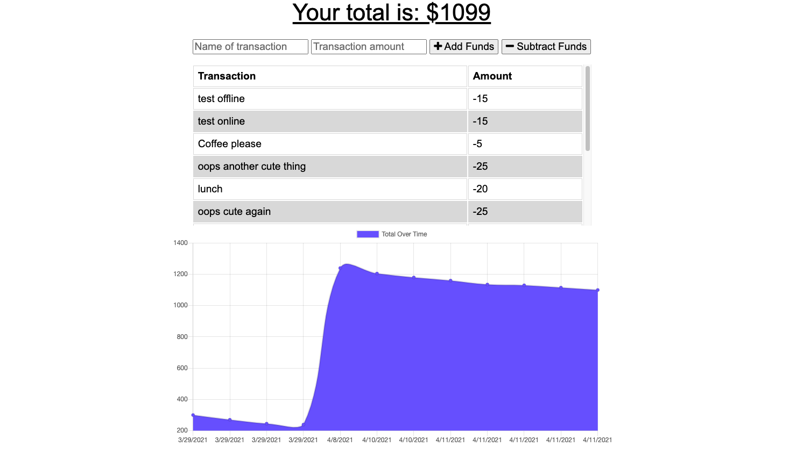
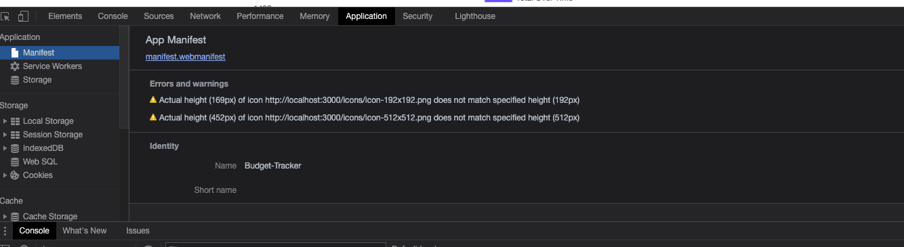
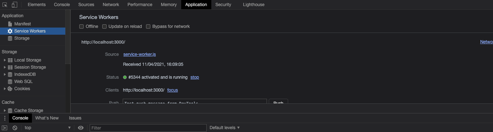
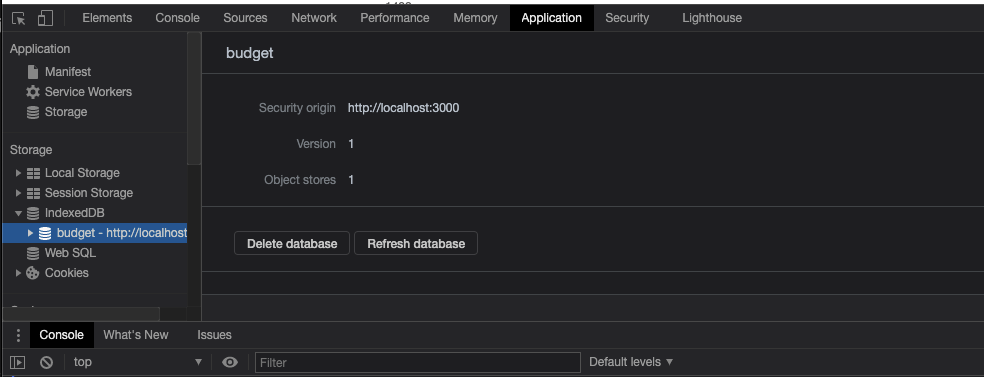

# Budget-Tracker
<h3>Homework_week18</h3>

<!-- TABLE OF CONTENTS -->
<details open="open">
  <summary>Table of Contents</summary>
  <ol>
    <li>
      <a href="#about-the-project">About The Project</a>
    </li>
      <li><a href="#Technology">Technology</a></li>
       <li><a href="#getting-started">Getting Started</a></li>
    <li><a href="#license">License</a></li>
    <li><a href="#Learning">Learning</a></li>
    <li><a href="#contact">Contact</a></li>
  </ol>
</details>


<!-- ABOUT THE PROJECT -->
## About The Project
Add functionality to our existing Budget Tracker application to allow for offline access and functionality.

The user will be able to add expenses and deposits to their budget with or without a connection. When entering transactions offline, they should populate the total when brought back online.

## Technology

Major framework I used to create this application.

* [Node.js](https://nodejs.org/en/)
* [Express](https://expressjs.com/)
* [MongoDB](https://www.mongodb.com/)
* [Mongoose](https://mongoosejs.com/docs/)
* [compression](https://www.npmjs.com/package/compression)
* [morgan](https://www.npmjs.com/package/morgan)
* [manifest.webmanifest]
* [service-worker]

## Getting Started

To use budget tracker locally, use http://localhost:3000 after completing the following steps:

```js
git clone github.com/Chib1co/Budget-Tracker
npm install
npm start
```

## Learning

This assignment already provided main functionality, but I had to add offline functionality. Which is using Progressive Web Application (PWA)

<!-- LICENSE -->
## License
[](https://opensource.org/licenses/MIT)

## Screenshot

* Home page


* Manifest in application


* Service Worker in application


* indexedDB in application



<!-- CONTACT -->
## Contact

Tomomi Inoue 
</br>

Project Link: [https://github.com/Chib1co/Budget-Tracker](https://github.com/Chib1co/Budget-Tracker)

Deployed page: [https://secret-shore-51741.herokuapp.com/](https://secret-shore-51741.herokuapp.com/)


